PRA2
================
Erola Fenollosa i Xavier Pasquet
22 desembre de 2021

# MEMÒRIA PRA2

### 0. Introducció

Aquest arxiu conté els apartats de la memòria de la *PRA2* juntament amb el codi per a respondre a les preguntes. Per tant el punt 7 de la memòria queda integrat en aquest mateix arxiu.

### 1. Descripció del dataset. Perquè és important i quina pregunta/problema pretén respondre?

El conjunt de dades generat en la PRA1 (<https://github.com/erolafr/InvasivePlantsScraper/blob/main/Mem%C3%B2riaPRA1.pdf>), que rep el nom de “Biodiversitat arbustiva i arbòria nativa i invasora a Espanya” i que serà analitzat en aquesta PRA2, és d’interès principalment per a gestors en relació a la conservació de la biodiversitat a nivell nacional. El conjunt de dades permet no només comptabilitzar el nombre d’espècies d’arbres i arbusts presents a Espanya sinó també realitzar anàlisis de la seva distribució territorial i per tant permetent l’ajust de polítiques de conservació i gestió de la biodiversitat adaptades a cada regió.

Són diverses les preguntes que esperem respondre amb el seu anàlisis, juntament amb les hipòtesis de partida:

1.  Quina és la *riquesa* nativa (nombre d'espècies totals) i invasora en les diferents *regions? *H1: Esperem que hi hagi heterogeneïtat en la riquesa d'espècies al territori, trobant una major riquesa nativa a les províncies amb reserves naturals per exemple, i major nombre d'espècies invasores a les províncies costaneres i ciutat més grans, degut a la seva major connectivitat.

2.  Quines són les *10 províncies amb major riquesa d'espècies? *H2: en la línia de la hipòtesi H1 esperem que les 10 províncies amb major riquesa d’espècies siguin aquelles que contenen reserves naturals.

3.  Hi ha *correlació entre riquesa nativa i invasora? *H3: Hi ha diverses hipòtesis amb suport empíric divers que sustenten que a major biodiversitat d'espècies, és més probable que hi hagi un menor nombre d'espècies invasores. Aquesta és la hipòtesi de la Resistència Biòtica (Enders et al., 2020). Així doncs esperem una correlació negativa entre la biodiversitat total d'una regió i el nombre d'espècies invasores.

4.  Hi ha correlació entre la *qualitat de l'arbrat* i la *riquesa* nativa? i invasora? H4: Esperem que hi hagi una correlació positiva entre la qualitat mitjana de la parcel·la i la riquesa d’espècies, assumint que els boscos amb major nombre d’espècies tenen també més qualitat. Respecte el nombre d’espècies invasores, podríem esperar que aquelles parcel·les amb espècies invasores tinguin una qualitat de l’arbrat inferior.

### 2. Integració i selecció de les dades d’interès a analitzar.

Incorporem les llibreries necesaries

``` r
library(dplyr)
```

    ## Warning: package 'dplyr' was built under R version 4.0.4

    ## 
    ## Attaching package: 'dplyr'

    ## The following objects are masked from 'package:stats':
    ## 
    ##     filter, lag

    ## The following objects are masked from 'package:base':
    ## 
    ##     intersect, setdiff, setequal, union

``` r
library(ggplot2)
```

    ## Warning: package 'ggplot2' was built under R version 4.0.4

``` r
library("sp")
```

    ## Warning: package 'sp' was built under R version 4.0.4

``` r
library(raster)
```

    ## Warning: package 'raster' was built under R version 4.0.5

    ## 
    ## Attaching package: 'raster'

    ## The following object is masked from 'package:dplyr':
    ## 
    ##     select

``` r
library(RColorBrewer)
```

Importem el csv

``` r
ifn3 <- read.csv("ifn3.csv")
```

Revisió de quines variables hi ha i fer subset d’algunes

``` r
#Revisem l'estructura global del dataset importat
str(ifn3)
```

    ## 'data.frame':    1264270 obs. of  20 variables:
    ##  $ Estadillo  : int  1 1 1 1 1 1 5 5 5 5 ...
    ##  $ Cla        : chr  "A" "A" "A" "A" ...
    ##  $ Subclase   : chr  "1" "1" "1" "1" ...
    ##  $ nArbol     : int  1 2 3 4 5 6 1 2 3 4 ...
    ##  $ OrdenIf3   : int  1 2 3 4 5 6 1 2 3 4 ...
    ##  $ OrdenIf2   : int  0 0 0 0 0 0 0 0 0 0 ...
    ##  $ Rumbo      : int  4 20 44 149 170 25 1 8 31 37 ...
    ##  $ Distanci   : num  2 15.4 8 7.5 8.8 ...
    ##  $ Especie    : chr  "Eucalyptus globulus" "Eucalyptus globulus" "Eucalyptus globulus" "Eucalyptus globulus" ...
    ##  $ Dn1        : int  136 314 151 154 155 141 209 240 260 244 ...
    ##  $ Dn2        : int  145 352 153 148 167 147 201 238 222 205 ...
    ##  $ Ht         : num  10 18 11.5 11.5 14 12.5 22.5 22.5 25 23 ...
    ##  $ Calidad    : int  2 2 2 2 2 2 2 2 2 2 ...
    ##  $ Forma      : int  2 2 2 2 2 2 2 2 2 2 ...
    ##  $ ParEsp     : int  NA NA NA NA NA NA NA NA NA NA ...
    ##  $ Agente     : int  100 100 100 100 100 100 100 100 100 100 ...
    ##  $ Import     : int  NA NA NA NA NA NA NA NA NA NA ...
    ##  $ Elemento   : int  NA NA NA NA NA NA NA NA NA NA ...
    ##  $ Provincia  : int  48 48 48 48 48 48 48 48 48 48 ...
    ##  $ Is_invasive: chr  "No" "No" "No" "No" ...

``` r
# Seleccionem les variables d'interès
ifn3_subset <- dplyr::select(ifn3, c(Estadillo, Especie, Calidad, Provincia, Is_invasive))

# Visualitzem el dataset filtrat:
head(ifn3_subset)
```

    ##   Estadillo             Especie Calidad Provincia Is_invasive
    ## 1         1 Eucalyptus globulus       2        48          No
    ## 2         1 Eucalyptus globulus       2        48          No
    ## 3         1 Eucalyptus globulus       2        48          No
    ## 4         1 Eucalyptus globulus       2        48          No
    ## 5         1 Eucalyptus globulus       2        48          No
    ## 6         1 Eucalyptus globulus       2        48          No

### 3. Neteja de les dades.

#### 3.1. Les dades contenen zeros o elements buits? Com gestionaries aquests casos?

Comptabilitzar casos amb zeros o elements buits en valor absolut i en percentatge per cada variable

``` r
colSums(is.na(ifn3_subset))
```

    ##   Estadillo     Especie     Calidad   Provincia Is_invasive 
    ##           0           0        2525           0           0

Hi ha uns quans valors nuls de qualitat. Visualizem un resum de les dades originals amb nulls a qualitat:

``` r
summary(ifn3[is.na(ifn3$Calidad),])
```

    ##    Estadillo        Cla              Subclase             nArbol     
    ##  Min.   :   3   Length:2525        Length:2525        Min.   : 1.00  
    ##  1st Qu.: 725   Class :character   Class :character   1st Qu.: 8.00  
    ##  Median :1389   Mode  :character   Mode  :character   Median :16.00  
    ##  Mean   :1395                                         Mean   :18.43  
    ##  3rd Qu.:1930                                         3rd Qu.:27.00  
    ##  Max.   :3355                                         Max.   :70.00  
    ##                                                                      
    ##     OrdenIf3          OrdenIf2          Rumbo          Distanci     
    ##  Min.   :  0.000   Min.   :  0.00   Min.   :  0.0   Min.   : 0.000  
    ##  1st Qu.:  0.000   1st Qu.:  7.00   1st Qu.:100.0   1st Qu.: 5.400  
    ##  Median :  0.000   Median : 13.00   Median :203.0   Median : 8.600  
    ##  Mean   :  1.147   Mean   : 16.04   Mean   :200.8   Mean   : 9.011  
    ##  3rd Qu.:  0.000   3rd Qu.: 22.00   3rd Qu.:299.0   3rd Qu.:12.100  
    ##  Max.   :999.000   Max.   :999.00   Max.   :399.0   Max.   :25.400  
    ##                                     NA's   :1       NA's   :1       
    ##    Especie               Dn1              Dn2               Ht        
    ##  Length:2525        Min.   :   0.0   Min.   :   0.0   Min.   :0.0000  
    ##  Class :character   1st Qu.: 261.0   1st Qu.: 260.8   1st Qu.:0.1000  
    ##  Mode  :character   Median : 351.0   Median : 351.0   Median :0.1000  
    ##                     Mean   : 370.8   Mean   : 370.3   Mean   :0.1163  
    ##                     3rd Qu.: 458.0   3rd Qu.: 456.2   3rd Qu.:0.1000  
    ##                     Max.   :1600.0   Max.   :1700.0   Max.   :6.5000  
    ##                     NA's   :1        NA's   :1        NA's   :2       
    ##     Calidad         Forma          ParEsp           Agente          Import    
    ##  Min.   : NA    Min.   :2      Min.   :  41.0   Min.   :100.0   Min.   :3     
    ##  1st Qu.: NA    1st Qu.:2      1st Qu.: 280.8   1st Qu.:100.0   1st Qu.:3     
    ##  Median : NA    Median :2      Median : 520.5   Median :100.0   Median :3     
    ##  Mean   :NaN    Mean   :2      Mean   : 520.5   Mean   :135.7   Mean   :3     
    ##  3rd Qu.: NA    3rd Qu.:2      3rd Qu.: 760.2   3rd Qu.:100.0   3rd Qu.:3     
    ##  Max.   : NA    Max.   :2      Max.   :1000.0   Max.   :421.0   Max.   :3     
    ##  NA's   :2525   NA's   :2524   NA's   :2523     NA's   :2516    NA's   :2524  
    ##     Elemento      Provincia     Is_invasive       
    ##  Min.   :9      Min.   :11.00   Length:2525       
    ##  1st Qu.:9      1st Qu.:15.00   Class :character  
    ##  Median :9      Median :27.00   Mode  :character  
    ##  Mean   :9      Mean   :26.71                     
    ##  3rd Qu.:9      3rd Qu.:36.00                     
    ##  Max.   :9      Max.   :36.00                     
    ##  NA's   :2524

S'observa que els que tenen espècie i qualitat null són arbres que es van inventariar en l'IFN2 i no s'han pogut inventariar el l'IFN3 (tenen Orden If3 = 0). Com que vull centrar-me només amb dades de l'IFN3 i no m'interesa comparara dades amb l'IFN2, descarto aquests valors.

``` r
# Elimino files amb espècie i qualitat nulls
ifn3_subset <- ifn3_subset[!is.na(ifn3_subset$Calidad),]
```

#### 3.2. Identificació i tractament de valors extrems.

generar histogrames per a atributs numerics i frequencia de casos en categorics.

``` r
# Gràfic de freqüències d'"Estadillo":
ggplot(ifn3_subset, aes(x = Estadillo)) + geom_histogram(bins = 30, color = "black", fill = "gray")
```

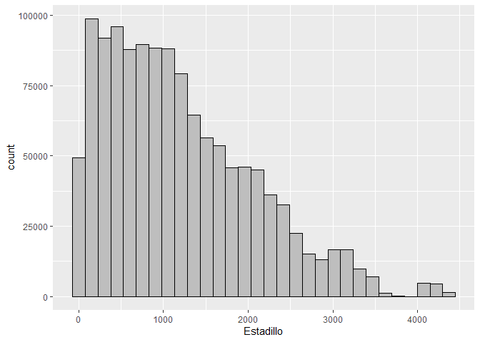

``` r
# Especie
ggplot(ifn3_subset, aes(Especie)) +
  geom_bar(fill = "#0073C2FF")
```

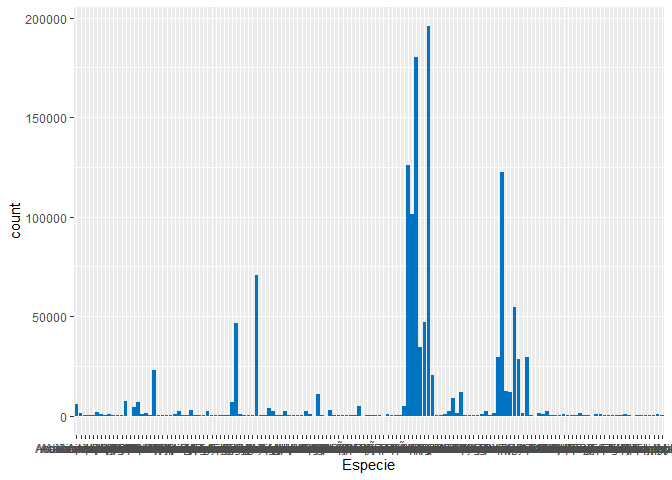

``` r
# Preparem un plot amb les 10 més abundants i amb les menys abundants
sp_count <- ifn3_subset %>%
  group_by(Especie) %>%
  summarise(counts = n()) %>%
  arrange(desc(counts))

sp_top10 <- sp_count[1:10,]
sp_last10 <- tail(sp_count,10)

ggplot(data=sp_top10, aes(x=Especie, y=counts)) +  geom_bar(stat="identity") +coord_flip() + ggtitle("Top 10 espècies amb més registres")
```

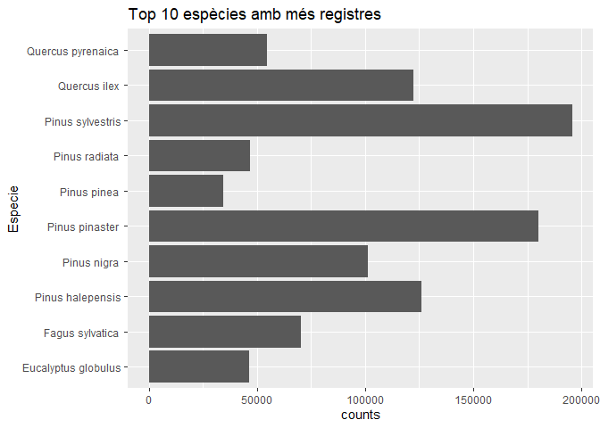

``` r
ggplot(data=sp_last10, aes(x=Especie, y=counts)) +  geom_bar(stat="identity") +coord_flip() + ggtitle("Top 10 espècies amb menys registres")
```

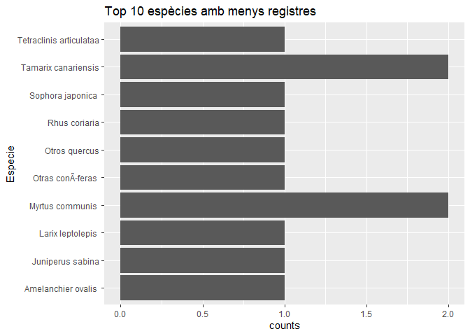

Revisem "Calidad"

``` r
ggplot(ifn3_subset, aes(x = Calidad)) + geom_histogram(bins = 40, color = "black", fill = "gray")
```

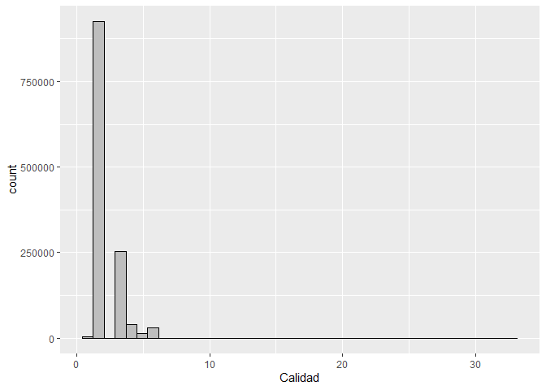

``` r
#Revisem el valor màxim i mínim
summary(ifn3_subset$Calidad)
```

    ##    Min. 1st Qu.  Median    Mean 3rd Qu.    Max. 
    ##   1.000   2.000   2.000   2.385   3.000  33.000

Tal i com veiem en l'histograma i també en mínim i màxim, la variable Calidad pren algun valor superior a les categories establertes (entre 1 i 6), revisem quants valors hi ha superiors a 6 i els eliminem:

``` r
sum(ifn3_subset$Calidad>6) # Hi ha 9 valors erronis
```

    ## [1] 9

``` r
ifn3_subset <-ifn3_subset[!c(ifn3_subset$Calidad>6),] # Els eliminem

#Tornem a fer l'histograma:
ggplot(ifn3_subset, aes(x = Calidad)) + geom_histogram(bins = 6, color = "black", fill = "gray")
```

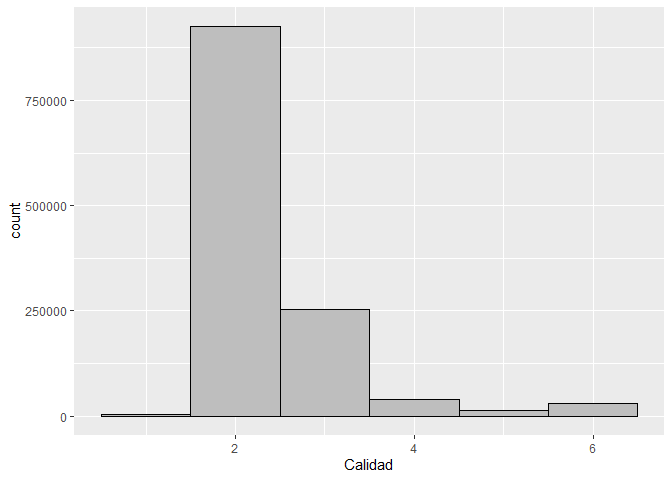

Revisem "Provincia"

``` r
ggplot(ifn3_subset, aes(x = Provincia)) + geom_histogram(bins = 40, color = "black", fill = "gray")
```

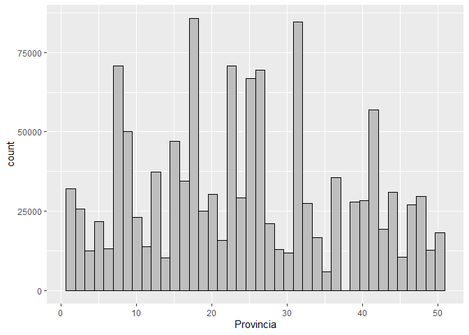

``` r
summary(ifn3_subset$Provincia)
```

    ##    Min. 1st Qu.  Median    Mean 3rd Qu.    Max. 
    ##     1.0    15.0    24.0    24.3    34.0    50.0

És correcte, tenim dades de 1 a 50.

Revisem "Is\_invasive":

``` r
# Revisem quins valors pren Is_invasive:
unique(ifn3_subset$Is_invasive)
```

    ## [1] "No"  "Yes"

``` r
#Revisem quants valors hi ha de cada classe:
ifn3_subset %>%
  group_by(Is_invasive) %>%
  summarise(counts = n())
```

    ## # A tibble: 2 x 2
    ##   Is_invasive  counts
    ##   <chr>         <int>
    ## 1 No          1261334
    ## 2 Yes             402

### 4. Anàlisi de les dades.

#### 4.1. Selecció dels grups de dades que es volen analitzar/comparar (planificació dels anàlisis a aplicar).

En primer lloc, agrupem les dades per parcel·la d'inventari, afegint una variable "conte\_invasora" i calculanem la mitjana i desviació estàndard de la qualitat dels arbres en la parcela per a resoldre les preguntes plantejades. i tenir noció també de la variabilitat el l'atribut de la qualitat. A més també calculem també la riquesa d'espècies total i d'invasores per parcela. Incorporem també en aquest dataset el valor de la província.

``` r
ifn_par <- ifn3_subset %>% group_by(Estadillo) %>% summarise(calidad = mean(Calidad), calidad_sd=sd(Calidad), conte_invasora = max(Is_invasive), riquesa_total = length(unique(Especie)), riquesa_invasores = sum(Is_invasive=="Yes"), provincia = max(Provincia))

# Exportem les dades
write.csv(ifn_par, "ifn_par.csv")

head(ifn_par)
```

    ## # A tibble: 6 x 7
    ##   Estadillo calidad calidad_sd conte_invasora riquesa_total riquesa_invasores
    ##       <int>   <dbl>      <dbl> <chr>                  <int>             <int>
    ## 1         1    2.44      0.920 No                        18                 0
    ## 2         2    2.48      0.987 No                        27                 0
    ## 3         3    2.41      0.839 No                        19                 0
    ## 4         4    2.36      0.816 No                        24                 0
    ## 5         5    2.42      0.855 No                        28                 0
    ## 6         6    2.38      0.835 No                        31                 0
    ## # ... with 1 more variable: provincia <int>

``` r
dim(ifn_par)
```

    ## [1] 4029    7

``` r
hist(ifn_par$calidad) #Visualitzem els valors que pren la calidad
```

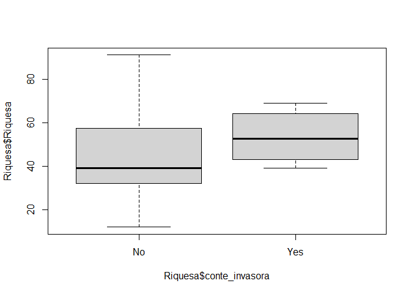

``` r
hist(ifn_par$riquesa_total) # Visualitzem els valors que pren la riquesa total d'espècies
```

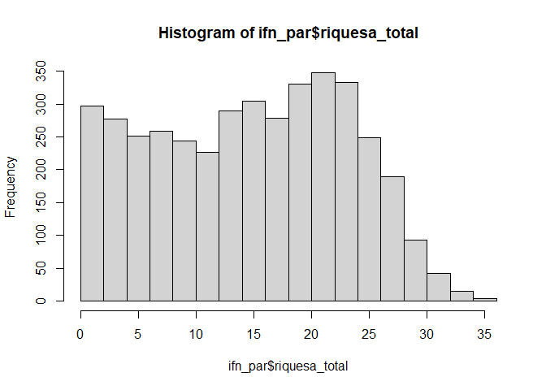

``` r
hist(ifn_par$riquesa_invasores) # Visualitzem els valors que pren la riquesa d'invasores
```

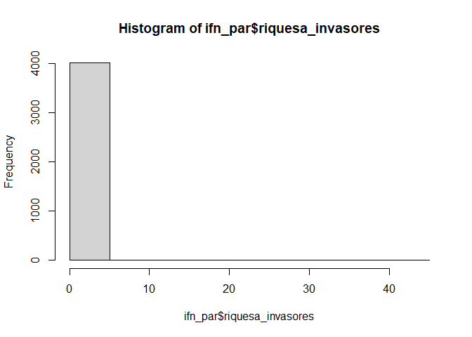

Un cop tenim les dades que ens interessen a nivell de parcel·la, les calculem a nivell de provincia

``` r
ifn_prov <- ifn_par %>% group_by(provincia) %>% summarise(calidad = mean(calidad), conte_invasora = max(conte_invasora), riquesa_total = mean(riquesa_total), riquesa_invasores = mean(riquesa_invasores))

# Obtenim les regions administratives, les provincies d'espanya
spain<- getData('GADM', country='ESP', level=2) 
# Afegim els noms de les províncies
codi_provincies <- read.csv(file = 'codi_provincies.csv', sep = ";") 
ifn_prov$CODE <- ifn_prov$provincia # canviem el nom per a poder fer merge
ifn_prov <- merge(ifn_prov, codi_provincies, by="CODE") # obtenim els noms de les províncies

# Exportem les dades
write.csv(ifn_prov, "ifn_prov.csv")
```

#### 4.2. Comprovació de la normalitat i homogeneïtat de la variància.

Comprovem normalitat de les variables d'interès

``` r
shapiro.test(ifn_par$calidad) 
```

    ## 
    ##  Shapiro-Wilk normality test
    ## 
    ## data:  ifn_par$calidad
    ## W = 0.71361, p-value < 2.2e-16

``` r
shapiro.test(ifn_par$riquesa_total) 
```

    ## 
    ##  Shapiro-Wilk normality test
    ## 
    ## data:  ifn_par$riquesa_total
    ## W = 0.96365, p-value < 2.2e-16

ELs p-valors són menors que 0.05, no podriem acceptar la normalitat de les dades, no obstant com que tenim una mostra prou gran, acceptem la normalitat pel teorema del central del límit,

comprovem homogeneitat de variancies:

``` r
bartlett.test(calidad ~ conte_invasora, data = ifn_par)
```

    ## 
    ##  Bartlett test of homogeneity of variances
    ## 
    ## data:  calidad by conte_invasora
    ## Bartlett's K-squared = 29.2, df = 1, p-value = 6.529e-08

``` r
bartlett.test(riquesa_total ~ conte_invasora, data = ifn_par)
```

    ## 
    ##  Bartlett test of homogeneity of variances
    ## 
    ## data:  riquesa_total by conte_invasora
    ## Bartlett's K-squared = 24.711, df = 1, p-value = 6.66e-07

ELs p-valors són menors que 0.05, per tant no podem acceptar la homogenetat de les variances.

#### 4.3. Aplicació de proves estadístiques per comparar els grups de dades. En funció de les dades i de l’objectiu de l’estudi, aplicar proves de contrast d’hipòtesis, correlacions, regressions, etc. Aplicar almenys tres mètodes d’anàlisi diferents.

Contrast d’hipotesis de si les parceles amb alguna invasora tenen millor qualitat o menys biodiversitat que les que no.

``` r
# Visualitzem en primer lloc:
boxplot(ifn_par$riquesa_total ~ ifn_par$conte_invasora)
```

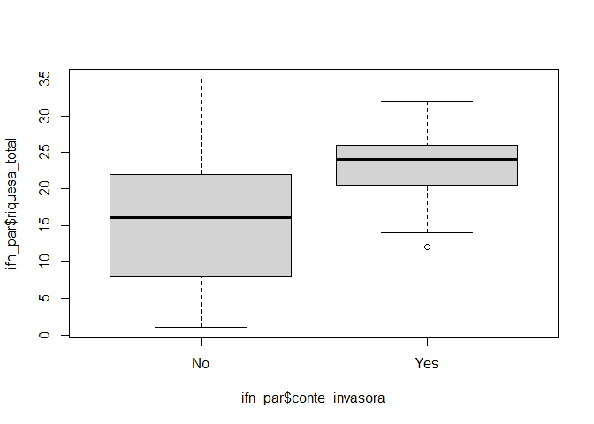

``` r
boxplot(ifn_par$calidad ~ ifn_par$conte_invasora)
```

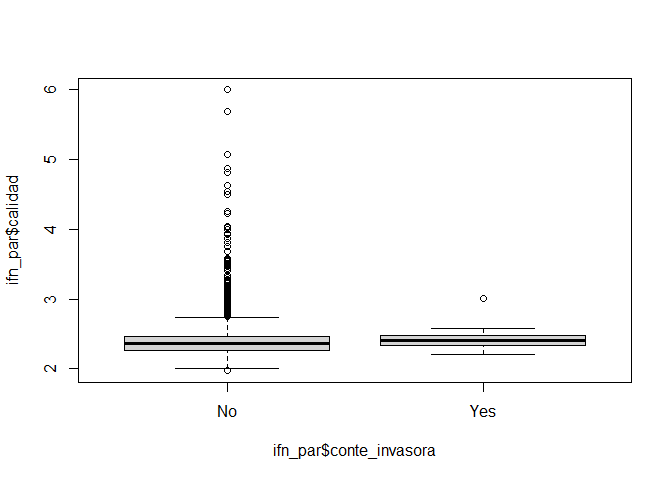

Correlació entre biodiversitat nativa i la biodiversitat invasora

``` r
fit1 <- lm(riquesa_total ~ riquesa_invasores, data =ifn_par)
summary(fit1)
```

    ## 
    ## Call:
    ## lm(formula = riquesa_total ~ riquesa_invasores, data = ifn_par)
    ## 
    ## Residuals:
    ##     Min      1Q  Median      3Q     Max 
    ## -14.132  -7.132   0.868   6.868  19.868 
    ## 
    ## Coefficients:
    ##                   Estimate Std. Error t value Pr(>|t|)    
    ## (Intercept)       15.13202    0.13174 114.867  < 2e-16 ***
    ## riquesa_invasores  0.39078    0.08734   4.474 7.88e-06 ***
    ## ---
    ## Signif. codes:  0 '***' 0.001 '**' 0.01 '*' 0.05 '.' 0.1 ' ' 1
    ## 
    ## Residual standard error: 8.343 on 4027 degrees of freedom
    ## Multiple R-squared:  0.004947,   Adjusted R-squared:  0.0047 
    ## F-statistic: 20.02 on 1 and 4027 DF,  p-value: 7.877e-06

``` r
ggplot(ifn_par, aes(x = riquesa_total, y = riquesa_invasores)) + 
  geom_point() +
  stat_smooth(method = "lm", col = "red")
```

    ## `geom_smooth()` using formula 'y ~ x'

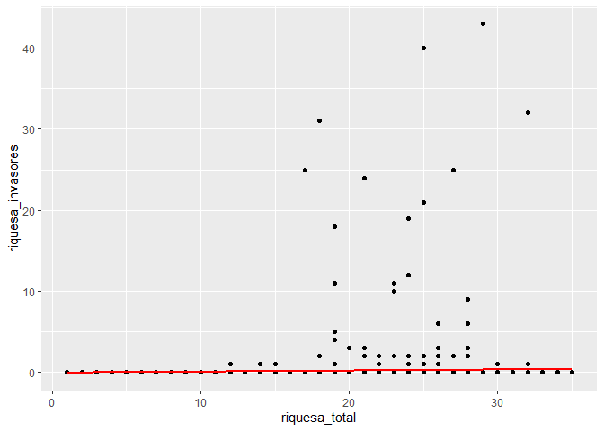 S'observa que pràcticament no existeix correlació entre les variables riquesa\_total i riquesa\_invasores

Correlació entre biodiversitat invasora i qualitat de l’arbrat

``` r
fit1 <- lm(calidad ~ riquesa_invasores, data =ifn_par)
summary(fit1)
```

    ## 
    ## Call:
    ## lm(formula = calidad ~ riquesa_invasores, data = ifn_par)
    ## 
    ## Residuals:
    ##     Min      1Q  Median      3Q     Max 
    ## -0.4164 -0.1180 -0.0285  0.0712  3.6121 
    ## 
    ## Coefficients:
    ##                   Estimate Std. Error t value Pr(>|t|)    
    ## (Intercept)       2.387852   0.004066 587.230   <2e-16 ***
    ## riquesa_invasores 0.001932   0.002696   0.717    0.474    
    ## ---
    ## Signif. codes:  0 '***' 0.001 '**' 0.01 '*' 0.05 '.' 0.1 ' ' 1
    ## 
    ## Residual standard error: 0.2575 on 4027 degrees of freedom
    ## Multiple R-squared:  0.0001276,  Adjusted R-squared:  -0.0001207 
    ## F-statistic: 0.5138 on 1 and 4027 DF,  p-value: 0.4735

``` r
ggplot(ifn_par, aes(x = calidad, y = riquesa_invasores)) + 
  geom_point() +
  stat_smooth(method = "lm", col = "red")
```

    ## `geom_smooth()` using formula 'y ~ x'

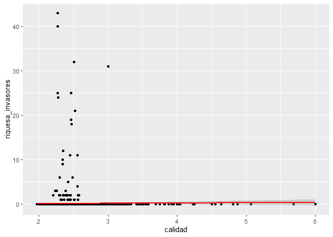

``` r
ggplot(ifn_par, aes(x = calidad, y = riquesa_total)) + 
  geom_point() +
  stat_smooth(method = "lm", col = "red")
```

    ## `geom_smooth()` using formula 'y ~ x'

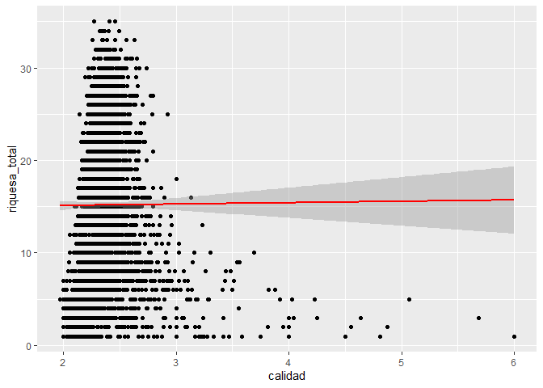 S'observa que pràcticament no existeix correlació entre les variables riquesa\_total i riquesa\_invasores

taula anova, p-valors del contrast d’hipotesi

``` r
# Calcul de l'ANOVA per qualitat i riquesa total
anova <- aov(ifn_prov$calidad ~ ifn_prov$riquesa_total)
summary(anova)
```

    ##                        Df Sum Sq  Mean Sq F value Pr(>F)
    ## ifn_prov$riquesa_total  1 0.0050 0.004985   0.204  0.655
    ## Residuals              27 0.6598 0.024438

El p-value és molt superior a 0,05, per tant no podem acceptar la hipotesis alternativa que la riquesa total es significativa de la qualitat.

``` r
# Calcul de l'ANOVA per qualitat i si la província conté invasores
anova <- aov(ifn_prov$calidad ~ ifn_prov$conte_invasora)
summary(anova)
```

    ##                         Df Sum Sq Mean Sq F value Pr(>F)
    ## ifn_prov$conte_invasora  1 0.0025 0.00249   0.101  0.752
    ## Residuals               27 0.6623 0.02453

El p-value és molt superior a 0,05, per tant no podem acceptar la hipotesis alternativa que la riquesa total es significativa de la qualitat.

### 5. Representació dels resultats a partir de taules i gràfiques.

Mapes de riquesa i qualitat per província

``` r
ordre_mapa <- ifn_prov[match(as.factor(spain$NAME_2), ifn_prov$NAME_2), ]

rbPal <- colorRampPalette(c('#f0f9e8','firebrick1'))
colorsllegenda<- c("#f0f9e8","firebrick1")

datcol <- rbPal(10)[as.numeric(cut(ordre_mapa$riquesa_invasores,breaks = 10))]
plot(spain, col=datcol, main = "Riquesa espècies invasores mitjana per parcel·la")
legend('topright', legend=c(round(min(ordre_mapa$riquesa_invasores, na.rm=TRUE),2), round(max(ordre_mapa$riquesa_invasores, na.rm=TRUE),2)), col=colorsllegenda, pch=16)
```

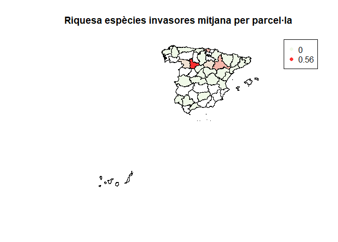

``` r
datcol <- rbPal(10)[as.numeric(cut(ordre_mapa$riquesa_total,breaks = 10))]
plot(spain, col=datcol, main = "Riquesa total mitjana per parcel·la")
legend('topright', legend=c(round(min(ordre_mapa$riquesa_total, na.rm=TRUE),2), round(max(ordre_mapa$riquesa_total, na.rm=TRUE),2)), col=colorsllegenda, pch=16)
```

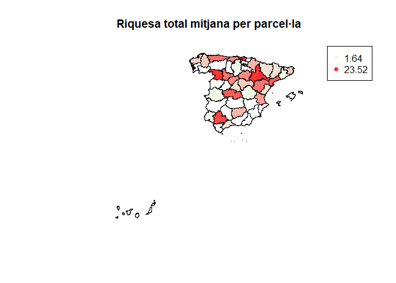

``` r
datcol <- rbPal(10)[as.numeric(cut(ordre_mapa$calidad,breaks = 10))]
plot(spain, col=datcol, main = "Qualitat arbrat mitjà per parcel·la")
legend('topright', legend=c(round(min(ordre_mapa$calidad, na.rm=TRUE),2), round(max(ordre_mapa$calidad, na.rm=TRUE),2)), col=colorsllegenda, pch=16)
```

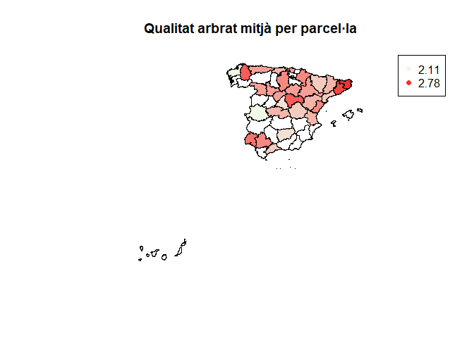

``` r
# Rànquing 10 provincies en riquesa total
top_r_total <- ifn_prov %>%filter(rank(desc(riquesa_total))<=10)
top_r_total
```

    ##    CODE provincia  calidad conte_invasora riquesa_total riquesa_invasores
    ## 1    33        33 2.399460            Yes      15.24000       0.020000000
    ## 2    39        39 2.351027             No      13.37500       0.000000000
    ## 3    41        41 2.465021             No      20.00000       0.000000000
    ## 4    43        43 2.300548             No      19.00000       0.000000000
    ## 5    44        44 2.353956            Yes      15.67541       0.009836066
    ## 6    45        45 2.321001             No      17.65854       0.000000000
    ## 7    47        47 2.379251            Yes      16.83333       0.555555556
    ## 8    48        48 2.380434            Yes      23.52381       0.222222222
    ## 9    49        49 2.401753            Yes      22.44048       0.103174603
    ## 10   50        50 2.389206            Yes      22.94176       0.219633943
    ##        NAME_2
    ## 1    Asturias
    ## 2   Cantabria
    ## 3     Sevilla
    ## 4   Tarragona
    ## 5      Teruel
    ## 6      Toledo
    ## 7  Valladolid
    ## 8     Vizcaya
    ## 9      Zamora
    ## 10   Zaragoza

``` r
# Rànquing 10 provincies en riquesainvasora
top_r_invasores <- ifn_prov %>%filter(rank(desc(riquesa_invasores))<=10)
top_r_invasores
```

    ##   CODE provincia  calidad conte_invasora riquesa_total riquesa_invasores
    ## 1   33        33 2.399460            Yes      15.24000       0.020000000
    ## 2   42        42 2.382521            Yes      13.03860       0.108771930
    ## 3   44        44 2.353956            Yes      15.67541       0.009836066
    ## 4   46        46 2.335961            Yes      11.86152       0.013119534
    ## 5   47        47 2.379251            Yes      16.83333       0.555555556
    ## 6   48        48 2.380434            Yes      23.52381       0.222222222
    ## 7   49        49 2.401753            Yes      22.44048       0.103174603
    ## 8   50        50 2.389206            Yes      22.94176       0.219633943
    ##       NAME_2
    ## 1   Asturias
    ## 2      Soria
    ## 3     Teruel
    ## 4   Valencia
    ## 5 Valladolid
    ## 6    Vizcaya
    ## 7     Zamora
    ## 8   Zaragoza

### 6. Resolució del problema. A partir dels resultats obtinguts, quines són les conclusions? Els resultats permeten respondre al problema?

Conclusions. Redactar.

### 7. Codi: Cal adjuntar el codi, preferiblement en R, amb el que s’ha realitzat la neteja, anàlisi i representació de les dades. Si ho preferiu, també podeu treballar en Python

Explicar que el codi està aquí

### Taula de contribucions:

Contribucions

-   Investigació prèvia:
-   Redacció de les respostes:
-   Desenvolupament del codi:
